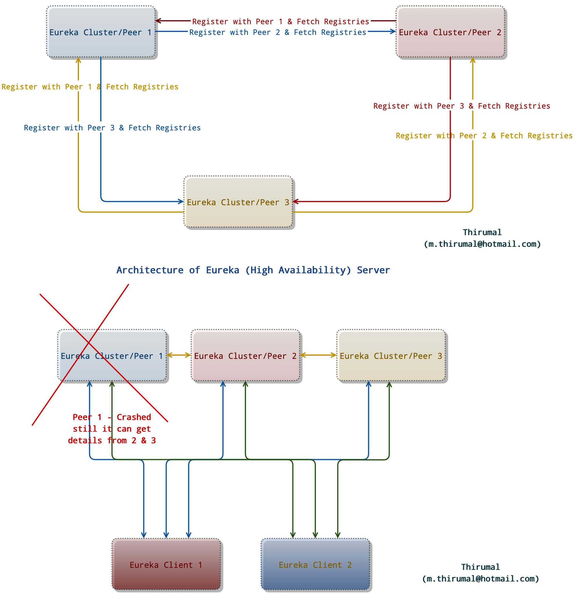

# Eureka-server 

* [Eureka Server](http://localhost:8761) high availability (HA) for Production

### Dependent project

* [Spring boot admin server](https://github.com/M-Thirumal/spring-boot-admin-server)

# To Create jar

	mvn clean install
	
	mvn clean package -DskipTests=true

# Run as jar from terminal

	java -jar target/eureka-server-0.0.1-SNAPSHOT.jar
	
	java -jar -Dspring.profiles.active=DEV-PRIMARY target/eureka-server-0.0.1-SNAPSHOT.jar
	
	java -jar -Dspring.profiles.active=DEV-SECONDARY target/eureka-server-0.0.1-SNAPSHOT.jar
	
	java -jar -Dspring.profiles.active=DEV-TERTIARY target/eureka-server-0.0.1-SNAPSHOT.jar

### Replica 

* Make sure `eureka.instance.hostname: ` is same as `eureka.client.serviceUrl.defaultZone`. Check how it's configured in `PRO environment`
	
### Swagger UI

[http://localhost:8761/swagger-ui/index.html](http://localhost:8761/swagger-ui/index.html)

### Credentials

	thirumal:thirumal
	
