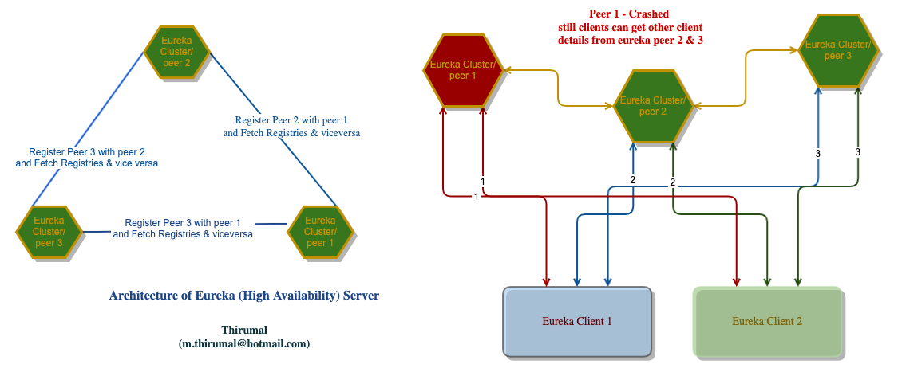

# Eureka-server 

* [Eureka Server](http://localhost:8761) high availability (HA) for Production

### Dependent project

* [Spring boot admin server](https://github.com/M-Thirumal/spring-boot-admin-server)

## To Create jar

	mvn clean install
	
	mvn clean package -DskipTests=true

## Run as jar from terminal

	java -jar target/eureka-server-0.0.1-SNAPSHOT.jar
	
	java -jar -Dspring.profiles.active=DEV-PRIMARY target/eureka-server-0.0.1-SNAPSHOT.jar
	
	java -jar -Dspring.profiles.active=DEV-SECONDARY target/eureka-server-0.0.1-SNAPSHOT.jar
	
	java -jar -Dspring.profiles.active=DEV-TERTIARY target/eureka-server-0.0.1-SNAPSHOT.jar
	
## Docker

Create docker layered image using the following command

	mvn package
	chmod -R 777 target/
	mkdir -p target/dependency && (cd target/dependency; jar -xf ../*.jar)
	chmod -R 777 target/
	docker build -t eureka-server .

Run the image (with desired)

	docker run --name primary --restart always -d -p 8761:8761 -e "SPRING_PROFILES_ACTIVE=DEV-PRIMARY" eureka-server
	docker run --name secondary --restart always -d -p 8762:8762 -e "SPRING_PROFILES_ACTIVE=DEV-SECONDARY" eureka-server
	docker run --name tertiary --restart always -d -p 8763:8763 -e "SPRING_PROFILES_ACTIVE=DEV-TERTIARY" eureka-server
	
	# If we use ${"HOST"} for ip-address
	docker run --name primary --restart always -d -p 8761:8761 -e "SPRING_PROFILES_ACTIVE=DEV-PRIMARY" -e "HOST=172.19.250.7" eureka-server
	docker run --name secondary --restart always -d -p 8762:8762 -e "SPRING_PROFILES_ACTIVE=DEV-SECONDARY" -e "HOST=172.19.250.8" eureka-server
	docker run --name tertiary --restart always -d -p 8763:8763 -e "SPRING_PROFILES_ACTIVE=DEV-TERTIARY" -e "HOST=172.19.250.9" eureka-server
	
### Start EUREKA as JAR at OS boot automatically

Add the below line in `crontab -e`
	
	@reboot /{path-to-eureka-server-script}/eureka-server.sh {ENV}

Example:
	
	@reboot /home/thirumal/git/eureka-server/eureka-server.sh DEV-PRIMARY
	
Note: Add `cd /path-to-repo` to the shell script (1'st line)
	
### Replica 

* Make sure `eureka.instance.hostname: ` is same as `eureka.client.serviceUrl.defaultZone`. Check how it's configured in `PRO environment`
* If you want some of cluster to be independent set `eureka.client.fetchRegistry` is `false`. That is, don't want to fetch details from other cluster. Check `UDEV` environment `UDEV-SECONDARY`
	
### Swagger UI

[http://localhost:8761/swagger-ui/index.html](http://localhost:8761/swagger-ui/index.html)

### Credentials

	thirumal:thirumal

### Extras - PROMETHEUS(Run the following docker command in the `prometheus.yml`file directory.

    [http://localhost:8761/actuator/prometheus](Prometheus actuator endpoint)    

    docker run -d -p 9090:9090 -v /Users/thirumal/git/eureka-server/prometheus.yml:/etc/prometheus/prometheus.yml prom/prometheus
	
